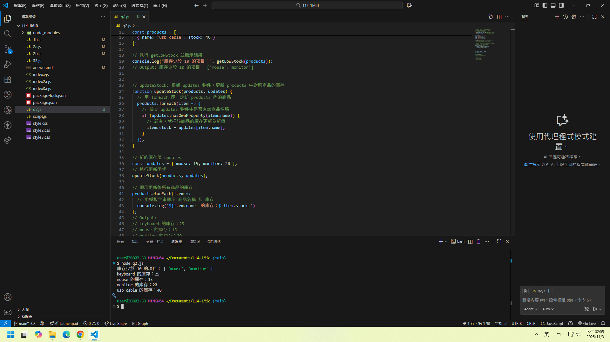
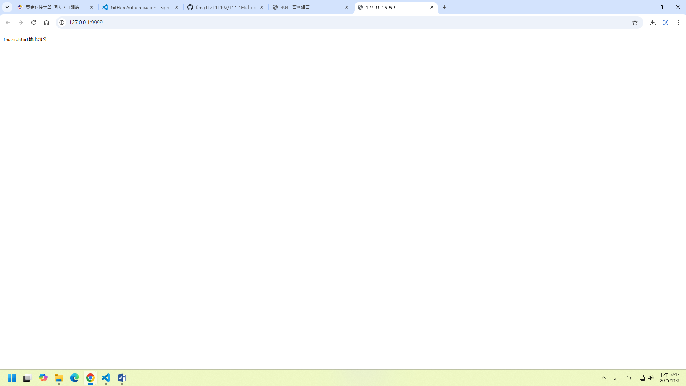
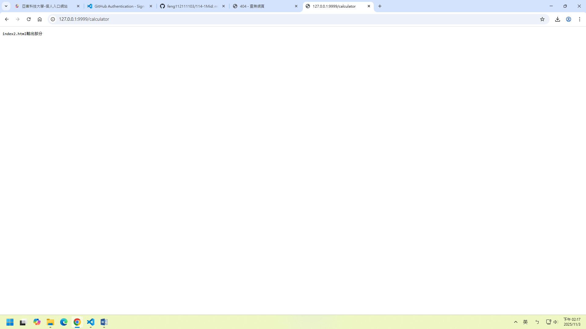
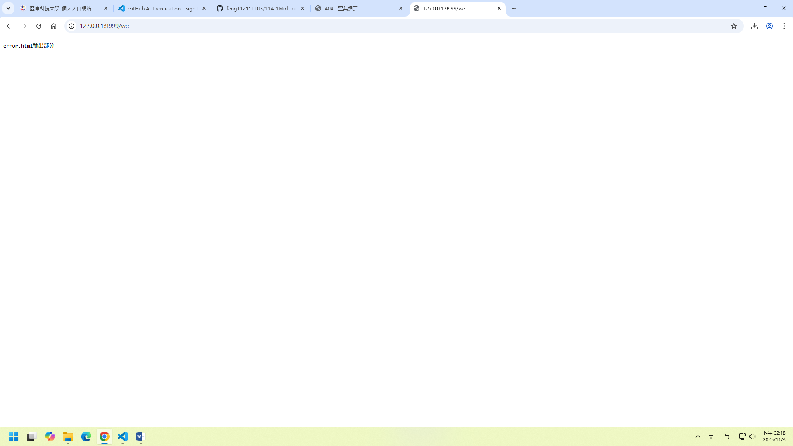
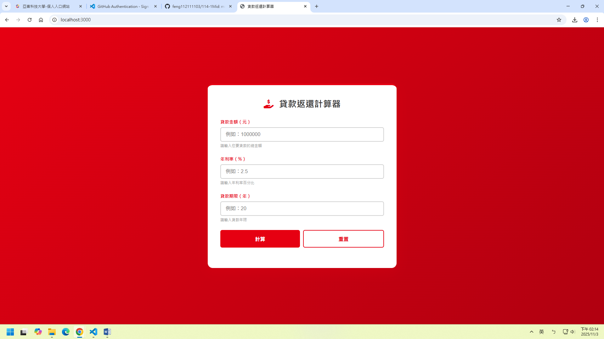
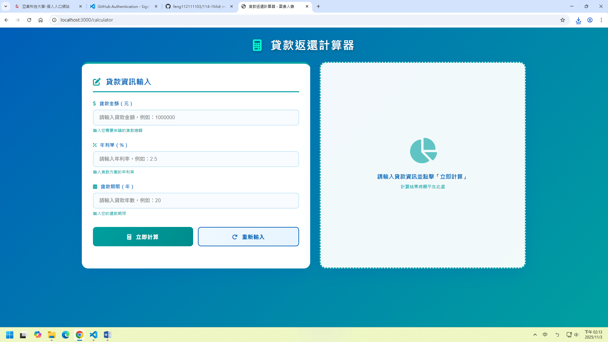
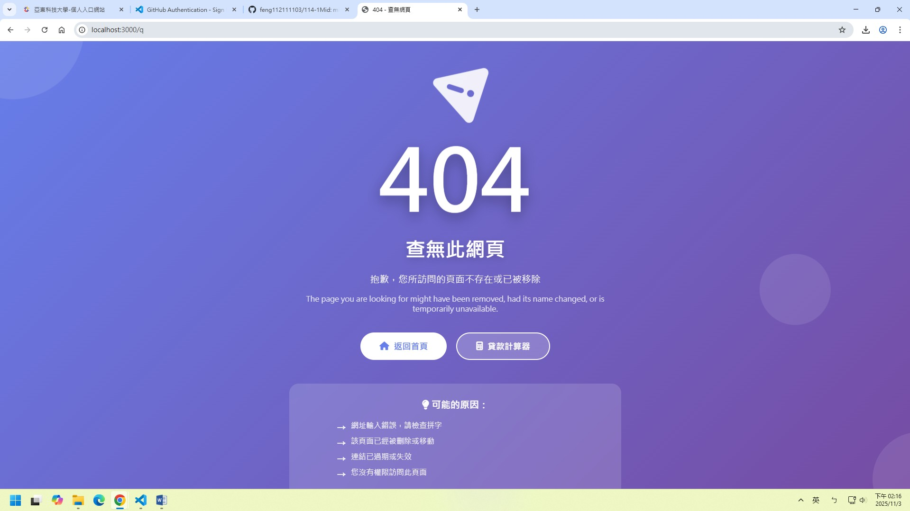

# 第2次隨堂題目-隨堂-QZ2
>
>學號：112111103   (學號和姓名都要寫)
><br />
>姓名：林群峰
>

本份文件包含以下主題：(至少需下面兩項，若是有多者可以自行新增)
- [x] 說明內容

## 說明程式與內容

開始寫說明，該說明需說明想法，
並於之後再對上述想法的每一部分將程式進一步進行展現，
若需引用程式區則使用下面方法，
若為.cs檔內程式除了於敘述中需註明檔案名稱外，
還需使用語法` ```語言種類 程式碼 ``` `，其中語言種類若是要用python則使用py，java則使用java，C/C++則使用cpp，
下段程式碼為語言種類選擇csharp使用後結果：

```csharp
public void mt_getResult(){
    ...
}
```

若要於內文中標示部分網頁檔，則使用以下標籤` ```html 程式碼 ``` `，
下段程式碼則為使用後結果：

```html
<%@ Page Language="C#" AutoEventWireup="true" ...>

<!DOCTYPE html>

<html xmlns="http://www.w3.org/1999/xhtml">
<head runat="server">
<meta http-equiv="Content-Type" ...>
    <title></title>
</head>
<body>
    <form id="form1" runat="server">
        <div>
        </div>
    </form>
</body>
</html>
```
更多markdown方法可參閱[https://ithelp.ithome.com.tw/articles/10203758](https://ithelp.ithome.com.tw/articles/10203758)

請在撰寫"說明程式與內容"該塊內容，請把原該塊內上述敘述刪除，該塊上述內容只是用來指引該怎麼撰寫內容。

1. a.

Ans: 
```html
<!DOCTYPE html>

<html xmlns="http://www.w3.org/1999/xhtml">
<head runat="server">
<meta http-equiv="Content-Type" ...>
    <title></title>
</head>
<body>
    <form id="form1" runat="server">
        <div>
        </div>
    </form>
</body>
</html>
```


1. b.

Ans:

```html
<!DOCTYPE html>

<html xmlns="http://www.w3.org/1999/xhtml">
<head runat="server">
<meta http-equiv="Content-Type" ...>
    <title></title>
</head>
<body>
    <form id="form1" runat="server">
        <div>
        // getLowStock: 取得庫存低於 10 的商品名稱陣列<br>
    function getLowStock(products) {
  // 用 filter 篩選，僅保留庫存量小於 10 的商品
  // 再用 map 取出每個商品的 name 屬性
  return products
    .filter(item => item.stock < 10) // 過濾庫存小於 10 的商品
    .map(item => item.name);         // 只取商品名稱構成新陣列
}

// 測試資料 products
const products = [
  { name: "keyboard", stock: 25 },
  { name: "mouse", stock: 5 },
  { name: "monitor", stock: 8 },
  { name: "usb cable", stock: 40 }
];

// 執行 getLowStock 並顯示結果
console.log("庫存少於 10 的項目：", getLowStock(products));
// Output: 庫存少於 10 的項目： ['mouse','monitor']
// Output: 庫存少於 10 的項目： ['mouse','monitor']
        </div>
    </form>
</body>
</html>
```

<!-- 請撰寫時，最後一句話再寫一次 -->


1. c.

Ans:

```html
<!DOCTYPE html>

<html xmlns="http://www.w3.org/1999/xhtml">
<head runat="server">
<meta http-equiv="Content-Type" ...>
    <title></title>
</head>
<body>
    <form id="form1" runat="server">
        <div>
        // getLowStock: 取得庫存低於 10 的商品名稱陣列<br>
        // getLowStock: 取得庫存低於 10 的商品名稱陣列<br>
    function getLowStock(products) {
  // 用 filter 篩選，僅保留庫存量小於 10 的商品
  // 再用 map 取出每個商品的 name 屬性
  return products
    .filter(item => item.stock < 10) // 過濾庫存小於 10 的商品
    .map(item => item.name);         // 只取商品名稱構成新陣列
}

// 測試資料 products
const products = [
  { name: "keyboard", stock: 25 },
  { name: "mouse", stock: 5 },
  { name: "monitor", stock: 8 },
  { name: "usb cable", stock: 40 }
];

// 執行 getLowStock 並顯示結果
console.log("庫存少於 10 的項目：", getLowStock(products));
// Output: 庫存少於 10 的項目： ['mouse','monitor']
        </div>
    </form>
</body>
</html>
```

<!--  請撰寫時，第一句話再寫一次  -->

2. a.

Ans:
Ans:<br>




```html
<!DOCTYPE html>

<html xmlns="http://www.w3.org/1999/xhtml">
<head runat="server">
<meta http-equiv="Content-Type" ...>
    <title></title>
</head>
<body>
    <form id="form1" runat="server">
        <div>
// 1、引入 http 模組 (Node.js 內建，用於建立 web 伺服器)
// 1、引入 http 模組 (Node.js 內建，用於建立 web 伺服器)
const http = require('http');

// 2、建立一個 HTTP 伺服器
// createServer() 接收一個回呼函式，當每次有客戶端發出請求時都會執行這個函式
const server = http.createServer(function (request, response) {
  const url = request.url;  // 取得使用者請求的網址路徑
  console.log(url);         // 在伺服器端輸出目前請求的 URL
  var answer = '';          // 定義回應內容的變數

  // 根據不同的 URL 使用 switch 判斷要回傳的內容
  switch (url) {
    case '/': // 若訪問根目錄
      answer = 'index.html輸出部分';
      break;
    case '/calculator': // 若訪問 /calculator
      answer = 'index2.html輸出部分';
      break;
    default: // 其他未定義路徑時
      answer = 'error.html輸出部分';
      break;
  }

  // 設定回應標頭，表示回傳內容為純文字格式，並使用 UTF-8 編碼避免亂碼
  response.setHeader('Content-Type', 'text/plain;charset=utf-8');

  // 回傳內容 (將上方設定的 answer 輸出給瀏覽器)
  response.end(answer);
});

// 3、設定伺服器監聽在本機 port 9999
// 啟動後可在瀏覽器輸入 http://127.0.0.1:9999 進行訪問
server.listen(9999, function () {
  console.log("伺服器啟動成功，訪問：http://127.0.0.1:9999");
});
</div>
    </form>
</body>
</html>
```

<!--  請撰寫時，第一句話再寫一次  -->

2. b.

Ans:
Ans:<br>


```html
<!DOCTYPE html>

<html xmlns="http://www.w3.org/1999/xhtml">
<head runat="server">
<meta http-equiv="Content-Type" ...>
    <title></title>
</head>
<body>
    <form id="form1" runat="server">
        <div>
switch (req.url) {
  // 若請求的 URL 是根路徑 '/'
  // 若請求的 URL 是根路徑 '/'
  case '/':
    // 載入首頁模板檔案
    filePath = '/index.ejs';
    break;

  // 若請求的 URL 是 '/calculator'
  case '/calculator':
    // 載入計算機頁面的模板檔案
    filePath = '/index2.ejs';
    break;
}
</div>
    </form>
</body>
</html>
```

<!--  請撰寫時，第一句話再寫一次  -->

2. c.

Ans:

```html
<!DOCTYPE html>

<html xmlns="http://www.w3.org/1999/xhtml">
<head runat="server">
<meta http-equiv="Content-Type" ...>
    <title></title>
</head>
<body>
    <form id="form1" runat="server">
        <div>
  // 其他的請求路徑
  // 其他的請求路徑
  default:
    // 判斷是否為靜態資源（例如 CSS、JS、圖片等）
    if (req.url.endsWith('.css') || req.url.endsWith('.js') || req.url.endsWith('.png') || req.url.endsWith('.jpg')) {
      // 若是靜態資源，就指定要直接讀取該檔案
      fileOtherFile = req.url;
    } else {
      // 若不是靜態資源或已知路徑，就載入錯誤頁（或其他預設頁）
      // 若不是靜態資源或已知路徑，就載入錯誤頁（或其他預設頁）
      filePath = '/index3.ejs';
    }
    break;
    </div>
    </form>
</body>
</html>
```

<!--  請撰寫時，第一句話和最後一句再寫一次  -->

2. d.

Ans:


